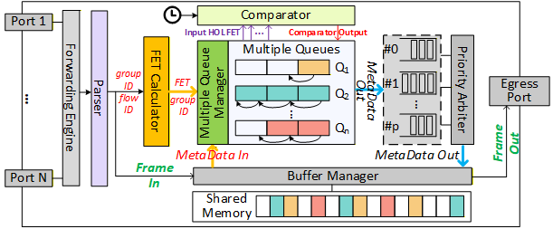
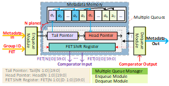

# Multiple Queues (MQ) Architecture — FPGA Implementation

This repository contains the FPGA implementation of the Multiple Queues (MQ) architecture presented in our paper:

> Designing Multiple Queues to Support Asynchronous Traffic Shaping in Shared-Buffer TSN Switches
> (submitted to IEEE TCAD)

MQ realizes Asynchronous Traffic Shaping (ATS) queues as metadata-driven logical queues on top of a shared-buffer switch architecture.

## Key Features

- Virtual queues implemented with lightweight head/tail pointers
- Centralized Multiple Queues Manager for enqueue/dequeue control
- Shift-register–based scheduler
- Full compatibility with IEEE 802.1Qcr ATS eligibility time computation

## Architecture

<figure>
  
  <figcaption>Figure 1. Architecture overview.</figcaption>
  </figure>

<figure>
  
  <figcaption>Figure 2. MQ planes structure.</figcaption>
</figure>

## License

Released under the MIT License.
